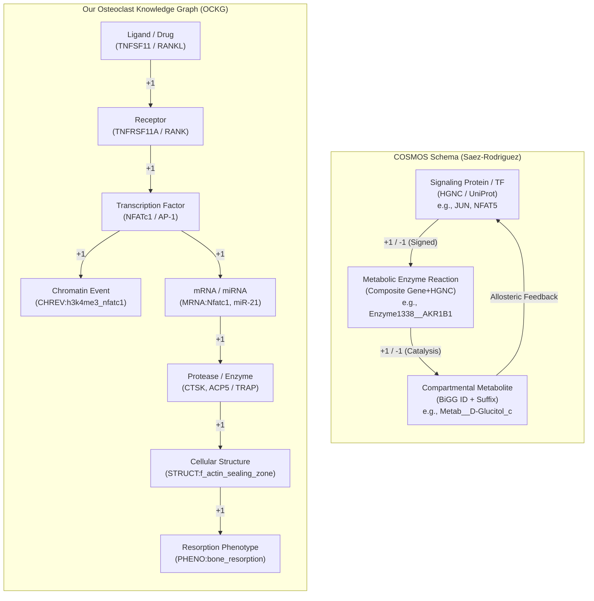
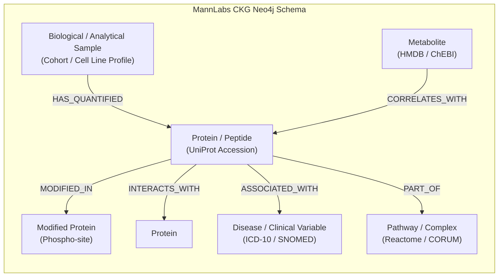
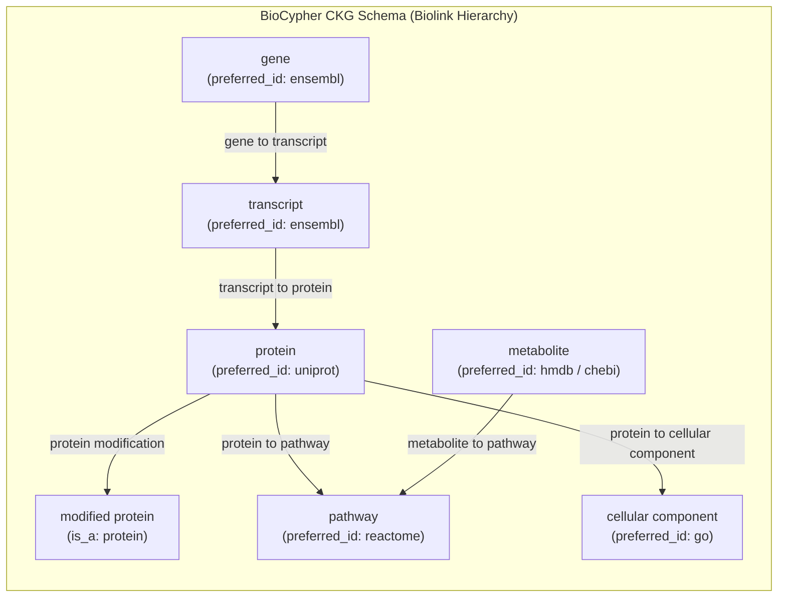
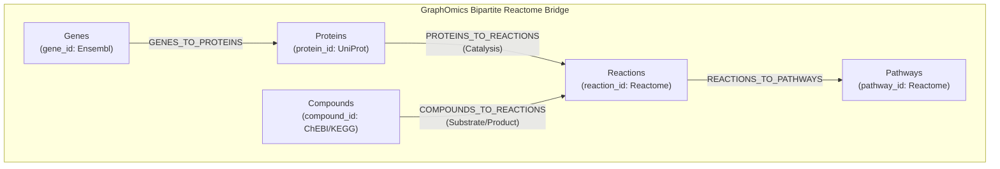
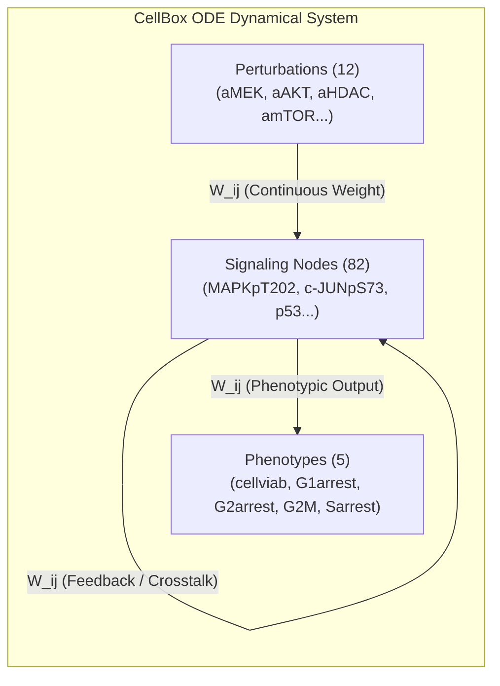
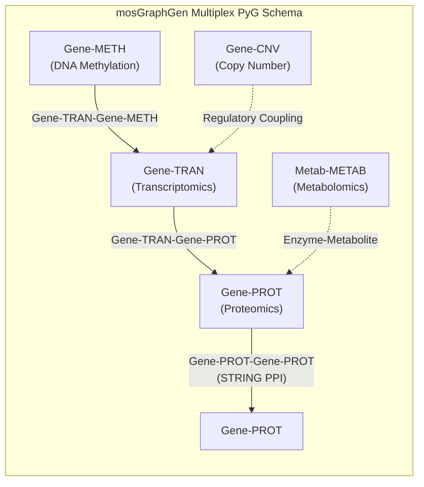
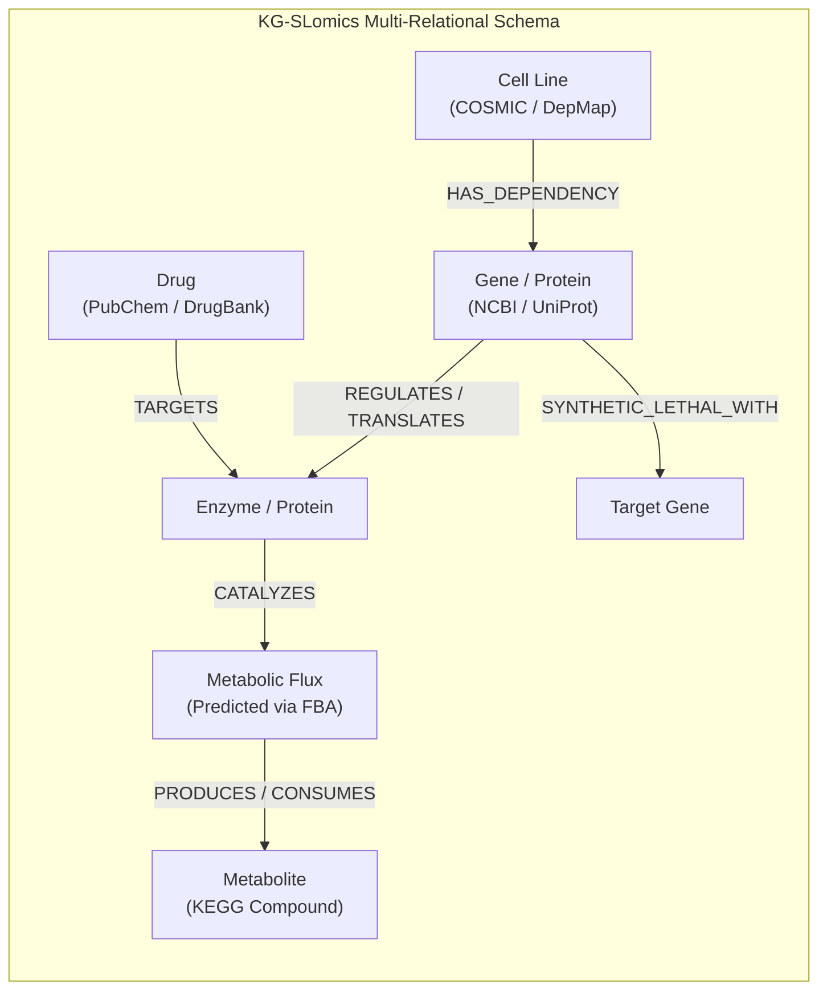
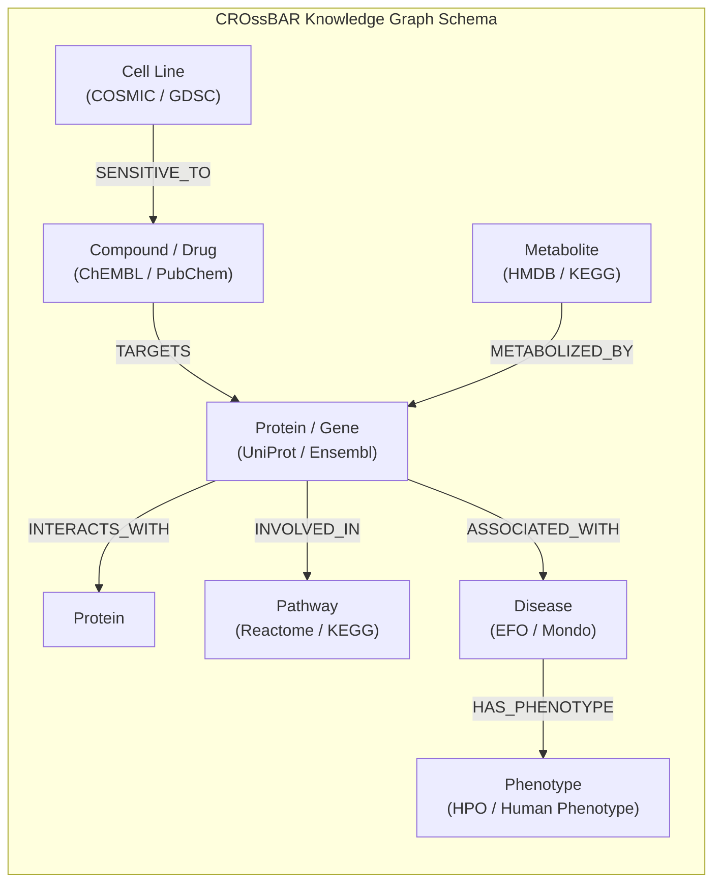

> Historical pre-repair report. Superseded for current schema/readiness by [SCHEMA_AND_PROVENANCE_REPAIR.md](SCHEMA_AND_PROVENANCE_REPAIR.md). Claims of verification or benchmark readiness below were not independently established.

# In-Depth Schema Comparison: Osteoclast Knowledge Graph (OCKG) vs. Published Benchmarks

## Executive Summary

Constructing knowledge graphs that bridge transcriptomics, proteomics/phosphoproteomics, and metabolomics for single cell lines or panels represents a major frontier in systems pharmacology. While public repositories contain several pioneering multi-omics knowledge graph architectures, they diverge significantly in their node granularity, edge semantics, mathematical formulations, and phenotypic grounding.

This benchmark compares the **Osteoclast Knowledge Graph (OCKG)** against the **8 primary open-source multi-omics knowledge graph frameworks** that provide downloadable schemas on GitHub:

1. **COSMOS** (*Causal Oriented Search of Multi-Omic Space*, Saez-Rodriguez Lab)
2. **Clinical Knowledge Graph (CKG)** (MannLabs)
3. **BioCypher CKG** (Lobentanzer et al., BioCypher Consortium)
4. **GraphOmics** (Wandy & Daly, Glasgow Computational Biology)
5. **CellBox** (Sander Lab)
6. **mosGraphGen** (Fuhai Li AI Lab)
7. **KG-SLomics** (GIST CSBL)
8. **CROssBAR** (CanSyL)

---

## 1. Master Comparative Benchmark Matrix

| Dimension | **Our OCKG** | **COSMOS** (Saez-Rodriguez) | **MannLabs CKG** (Mann Lab) | **BioCypher CKG** (Lobentanzer) | **GraphOmics** (Glasgow) | **CellBox** (Sander Lab) | **mosGraphGen** (Fuhai Li Lab) | **KG-SLomics** (GIST CSBL) | **CROssBAR** (CanSyL) |
| :--- | :--- | :--- | :--- | :--- | :--- | :--- | :--- | :--- | :--- |
| **Primary GitHub** | Local Workspace | [saezlab/cosmosR](https://github.com/saezlab/cosmosR) | [MannLabs/CKG](https://github.com/MannLabs/CKG) | [biocypher/ckg](https://github.com/biocypher/clinical-knowledge-graph) | [glasgowcompbio/GraphOmics](https://github.com/glasgowcompbio/GraphOmics) | [sanderlab/CellBox](https://github.com/sanderlab/CellBox) | [FuhaiLiAiLab/mosGraphGen](https://github.com/FuhaiLiAiLab/mosGraphGen) | [GIST-CSBL/KG-SLomics](https://github.com/GIST-CSBL/KG-SLomics) | [cansyl/CROssBAR](https://github.com/cansyl/CROssBAR) |
| **Primary Citation** | Internal Curated (2026) | Dugourd et al., *Mol Syst Biol* (2021) | Santos et al., *Nat Biotechnol* (2022) | Lobentanzer et al., *Nat Biotechnol* (2023) | Wandy & Daly, *Bioinformatics* (2021) | Yuan et al., *Cell Syst* (2021) | Li et al., *IEEE BIBM* (2022/2023) | Lee et al., *Bioinformatics* (2023) | Doğru et al., *NAR Genom Bioinform* (2021) |
| **Core Paradigm** | Relational property graph + signed causal propagation | Prior Knowledge Network (PKN) + CARNIVAL ILP solver | Neo4j Labeled Property Graph (LPG) | Biolink Model YAML hierarchical property graph | Bipartite Reactome reaction & pathway bridge | Non-linear ODE dynamical state-space ($W_{ij}$ Jacobian) | Multiplex heterogeneous PyTorch Geometric (PyG) tensors | Heterogeneous link-prediction knowledge graph + FBA | Heterogeneous Neo4j graph & KG embedding (TransE/ComplEx) |
| **Node Subtypes** | **11 Subtypes**: `protein`, `metabolite`, `drug`, `mrna`, `mirna`, `reaction`, `chromatin_event`, `differentiation_stage`, `cellular_structure`, `phenotype`, `gene` | **4 Subtypes**: `Signaling_Protein_or_TF`, `Metabolic_Enzyme_Reaction`, `Metabolite`, `Complex_or_Heterodimer` | **16 Subtypes**: `Protein`, `Modified_protein`, `Peptide`, `Metabolite`, `Gene`, `Transcript`, `Disease`, `Pathway`, `Sample`, etc. | **33 Subtypes**: Biolink standardized hierarchy (`amino acid sequence`, `modified protein`, `metabolite`, `gene`, `pathway`, etc.) | **5 Subtypes**: `genes`, `proteins`, `compounds`, `reactions`, `pathways` | **3 Subtypes**: Protein/Phospho epitopes (82), Perturbations (12), Phenotypes (5) | **5 Subtypes**: Multiplex layers (`Gene-TRAN`, `Gene-PROT`, `Gene-METH`, `Gene-CNV`, `Metab`) | **6 Subtypes**: `Gene`, `Protein`, `Metabolite`, `Metabolic_Flux`, `Cell_Line`, `Drug` | **7 Subtypes**: `Protein/Gene`, `Compound/Drug`, `Metabolite`, `Cell_Line`, `Pathway`, `Disease`, `Phenotype` |
| **Edge Semantics** | **Signed Causal** (+1, -1, 0) across 16 typed relations (`ACTIVATES`, `INHIBITS`, `FORMS_STRUCTURE`, etc.) | **Signed Directed** (+1 activation, -1 inhibition / consumption) | **Typed Unsigned** (42 relation types: `INTERACTS_WITH`, `ASSOCIATED_WITH`, etc.) | **Typed Unsigned** (48 Biolink relations: `transcript to protein`, `metabolite to pathway`, etc.) | **Bipartite Relational** (Reaction bridge: `gene->prot`, `prot->rxn`, `compound->rxn`) | **Continuous Signed Weights** ($W_{ij} \in \mathbb{R}$ ODE interaction matrix) | **Weighted Unsigned Tensors** (Intra-layer PPI, inter-layer regulatory edges) | **Multi-relational Directed** (Regulatory, catalytic, consumption, synthetic lethality) | **Typed Unsigned** (14 relations: `INTERACTS_WITH`, `TARGETS`, `INVOLVED_IN`, etc.) |
| **Omics Layers Integrated** | Transcriptomics, Phospho/Proteomics, Metabolomics, Epigenomics (ChIP-seq), non-coding RNA | Transcriptomics (TF activity), Phosphoproteomics, Metabolomics | Transcriptomics, Proteomics, Phosphoproteomics, Metabolomics, Clinical metadata | Proteomics, Phosphoproteomics, Metabolomics, Transcriptomics, GWAS | Transcriptomics, Proteomics, Metabolomics via Reactome reactions | Targeted Phosphoproteomics (RPPA), Targeted Drug Inhibitors | Transcriptomics, Methylation, Proteomics, CNV, Metabolomics | Transcriptomics, CRISPR knockouts, Metabolic Fluxes (FBA) | Transcriptomics, Proteomics, Compound Bioactivity, Phenotypes |
| **Cell Line / Lineage Boundary** | **Strict single-lineage**: Mouse BMMs & RAW 264.7 under RANKL | **Pan-cancer cell lines** (e.g. 786-0 RCC, CCLE panel) | **Patient cohorts & diverse cell lines** | **Modular adapters** for any patient/cell line dataset | **Flexible multi-sample** comparative matrices | **Single cell line** (SK-MEL-133 melanoma under 89 perturbations) | **CCLE pan-cancer panel** (800+ cancer cell lines) | **CCLE / DepMap panel** (700+ cancer cell lines) | **Pan-disease / cell line repository** |
| **Cellular Compartments** | Cytoplasm, Nucleus, Mitochondria, Plasma Membrane, Extracellular | Cytosol (`_c`), Mitochondria (`_m`), Extracellular (`_e`), etc. | Subcellular components via GO annotations | Biolink cellular components via GO | Implicit via Reactome reaction compartment mappings | None (lumped whole-cell ODE state variables) | None (feature tensors) | Compartmentalized via BiGG/Recon GEM models | Cellular component annotations |
| **Phenotype Modeling** | Direct quantitative nodes (`bone_resorption`, `cell_fusion`) + structures | None (terminates at metabolite flux/signaling) | Broad clinical findings / disease endpoints | Phenotypic features (`phenotypic feature` node) | Reactome pathway diagrams | 5 Phenotypes (`cellviab`, `G1arrest`, `G2arrest`, `Sarrest`, `G2M`) | Survival / $IC_{50}$ prediction targets | Synthetic lethality binary labels | Disease and phenotype annotations (HPO / EFO) |
| **Experimental Evidence** | **345 1:1 curated records** (PMID, assay, dose, duration, cell type, figure/table) | Computed via meta-PKN database consensus | Database evidence + patient sample measurements | Database evidence cross-references (`pmid`, `doi`) | Empirical $p$-values and fold-changes from input matrices | 89 experimental perturbation conditions (RPPA measurements) | Multi-omic matrix entries | CCLE/DepMap CRISPR screens + GDSC drug screens | Omnipath, ChEMBL, DrugBank, PubChem annotations |

---

## 2. Granular Benchmarks Deep-Dive

### Benchmark 1: COSMOS (*Causal Oriented Search of Multi-Omic Space*)
- **Developer**: Saez-Rodriguez Group (Heidelberg University / EMBL-EBI)
- **Repository**: [https://github.com/saezlab/cosmosR](https://github.com/saezlab/cosmosR) & [saezlab/COSMOS_basic](https://github.com/saezlab/COSMOS_basic)
- **Canonical Citation**: Dugourd et al., "Causal integration of multi-omics data with prior knowledge to generate mechanistic hypotheses", *Molecular Systems Biology* (2021) 17:e10093.

#### Detailed Schema Mechanics
- **Node Formats**:
  - `Signaling_Protein_or_TF`: Pure HGNC symbols (5,789 nodes in human meta-PKN).
  - `Metabolic_Enzyme_Reaction`: Composite IDs joining NCBI Gene ID with HGNC symbol, e.g. `Enzyme1338__AKR1B1` (19,532 nodes).
  - `Metabolite`: BiGG namespace with explicit compartment suffixes: `_c` (cytoplasm), `_m` (mitochondria), `_e` (extracellular), `_r` (endoplasmic reticulum), `_n` (nucleus), e.g. `Metab__D-Glucitol_c` (10,773 nodes).
- **Edge Algebra**: Strictly signed directed edges (+1 for activation or forward production, -1 for inhibition or consumption). Operates via an Integer Linear Programming (ILP) formulation using CARNIVAL:
  $$\min \sum_{e \in E} c_e \cdot x_e \quad \text{s.t. conservation of causal flow between TF footprint activities and metabolite log2FC}$$
- **Cell Line Integration**: Demonstrated on human cell line 786-0 (renal cell carcinoma). Phosphoproteomics and transcriptomics are processed through DoRothEA and PROGENy to infer TF/kinase perturbation states, while LC-MS metabolomics provides target sinks.
- **Comparison with OCKG**:
  - *Shared*: Causal signed propagation (+1 / -1), directional multi-omic bridging from upstream signaling to downstream metabolic consequences.
  - *OCKG Advantages*: OCKG directly models epigenetic states (`CHREV:`), physical cellular structures (`STRUCT:f_actin_sealing_zone`, `STRUCT:syncytium`), and quantitative resorption phenotypes (`PHENO:bone_resorption`). COSMOS terminates at metabolite consumption/production and cannot capture morphological differentiation milestones or non-coding regulatory RNAs.

---

### Benchmark 2: Clinical Knowledge Graph (CKG)
- **Developer**: Mann Laboratory (Max Planck Institute of Biochemistry / University of Copenhagen)
- **Repository**: [https://github.com/MannLabs/CKG](https://github.com/MannLabs/CKG)
- **Canonical Citation**: Santos et al., "Clinical Knowledge Graph integrates proteomics data with clinical and experimental data", *Nature Biotechnology* (2022) 40:865–873.

#### Detailed Schema Mechanics
- **Node Formats**: Neo4j Labeled Property Graph spanning 16 canonical node labels: `Protein` (UniProt), `Modified_protein` (UniProt-residue), `Peptide`, `Metabolite` (HMDB, ChEBI), `Gene` (HGNC, Ensembl), `Transcript`, `Disease` (DOID, ICD-10), `Biological_process` (GO-BP), `Cellular_component` (GO-CC), `Pathway` (Reactome).
- **Edge Algebra**: 42 relationship types. Predominantly **unsigned (0)** and associative: `INTERACTS_WITH`, `IS_BIOMARKER_OF`, `CORRELATES_WITH`, `ASSOCIATED_WITH`, `MENTIONED_IN_PUBLICATION`. Does not enforce signed causal flow (+1 / -1).
- **Cell Line Integration**: Connects high-throughput mass-spectrometry clinical proteomics to patient analytical samples. Cell line experiments are ingested as sample instances with quantitative log2 abundance properties attached directly to relationships.
- **Comparison with OCKG**:
  - *CKG Advantages*: Immense encyclopedic breadth (~20M nodes, ~220M edges) spanning clinical cohorts, pathology, medications, and clinical chemistry.
  - *OCKG Advantages*: OCKG enforces strict causal sign propagation (+1 / -1) and differentiation stage progression (`uncommitted -> committed mononuclear TRAP+ -> syncytium -> mature multinucleated`). In CKG, one cannot traverse signed activation/inhibition cascades to evaluate whether an inhibitor blocks bone resorption.

---

### Benchmark 3: BioCypher CKG
- **Developer**: BioCypher Consortium (Lobentanzer et al., Saez-Rodriguez Lab, Heidelberg)
- **Repository**: [https://github.com/biocypher/clinical-knowledge-graph](https://github.com/biocypher/clinical-knowledge-graph) & [biocypher/biocypher](https://github.com/biocypher/biocypher)
- **Canonical Citation**: Lobentanzer et al., "Democratizing knowledge representation with BioCypher", *Nature Biotechnology* (2023) 41:1056–1059.

#### Detailed Schema Mechanics
- **Node Formats**: 33 strictly typed entity classes governed by the Biolink Model ontology (`config/full_schema_config.yaml`). Every entity inherits from the Biolink root `named thing` (e.g., `amino acid sequence` *is_a* `polypeptide`, `modified protein` *is_a* `protein`, `biological sample` *is_a* `material sample`). Identifiers are strictly namespaced (`preferred_id: uniprot`, `preferred_id: chebi`, `preferred_id: ensembl`).
- **Edge Algebra**: 48 typed predicate edges defined with Biolink semantic predicates: `gene to transcript relationship`, `transcript to protein relationship`, `protein to biological process association`, `metabolite to pathway association`. Relationships are structural and semantic rather than signed causal algebra.
- **Cell Line Integration**: Modular Python extractors map sample multi-omics into standardized property graphs and graph embedding configurations (`embedding_schema_config.yaml`).
- **Comparison with OCKG**:
  - *BioCypher Advantages*: Gold standard for ontological harmonization, semantic web inheritance, and multi-database deduplication.
  - *OCKG Advantages*: OCKG provides signed activation/inhibition values (+1 / -1) and direct experimental assay tracking (e.g. TRAP+ multinucleation, pit resorption assays, CCK-8 viability) tied to single-lineage osteoclast differentiation stages.

---

### Benchmark 4: GraphOmics
- **Developer**: Glasgow Computational Biology (Wandy & Daly, University of Glasgow)
- **Repository**: [https://github.com/glasgowcompbio/GraphOmics](https://github.com/glasgowcompbio/GraphOmics)
- **Canonical Citation**: Wandy & Daly, "GraphOmics: an interactive platform to explore and integrate multi-omics data", *Bioinformatics* (2021) 37(18):3049–3051.

#### Detailed Schema Mechanics
- **Node Formats**: Fixed 5-entity relational schema mapped through Reactome:
  1. `genes` (`gene_id`, Ensembl / HGNC)
  2. `proteins` (`protein_id`, UniProt)
  3. `compounds` (`compound_id`, ChEBI / KEGG)
  4. `reactions` (`reaction_id`, Reactome `R-HSA-...`)
  5. `pathways` (`pathway_id`, Reactome `R-HSA-...`)
- **Edge Algebra**: 4 bipartite relational bridges (`GENES_TO_PROTEINS`, `PROTEINS_TO_REACTIONS`, `COMPOUNDS_TO_REACTIONS`, `REACTIONS_TO_PATHWAYS`). Edges are strictly structural/bipartite and **unsigned**.
- **Cell Line Integration**: Users upload tabular differential expression matrices (log2 fold change, $p$-value, adjusted $p$-value) for transcriptomics, proteomics, and metabolomics. GraphOmics links them through Reactome reactions to compute multi-table cross-filtering (Firdi) and pathway enrichment (PLAGE, ORA, Reactome Analysis API).
- **Comparison with OCKG**:
  - *GraphOmics Advantages*: Solves the protein-to-metabolite connection via explicit biochemical reactions; outstanding interactive web interface with synchronized cross-table filtering.
  - *OCKG Advantages*: OCKG directly captures gene regulatory networks, non-coding RNAs (miRNAs targeting mRNAs), chromatin modification events, and morphological transitions. GraphOmics lacks causal regulatory edge direction (+1 / -1) and cannot model non-enzymatic signaling cascades or transcription factor cooperativity.

---

### Benchmark 5: CellBox
- **Developer**: Sander Laboratory (Harvard Medical School / Dana-Farber Cancer Institute)
- **Repository**: [https://github.com/sanderlab/CellBox](https://github.com/sanderlab/CellBox)
- **Canonical Citation**: Yuan et al., "CellBox: Interpretable Machine Learning for Cellular Trajectories and Perturbation Biology", *Cell Systems* (2021) 12(2):128–140.

#### Detailed Schema Mechanics
- **Node Formats**: 99 continuous variables:
  - 82 Protein and Phospho-epitopes measured via Reverse Phase Protein Arrays (RPPA) (e.g., `4EBP1pS65`, `MAPKpT202`, `c-JUNpS73`, `AKTpS473`, `AMPKpT172`, `c-Myc`).
  - 12 Targeted Drug Perturbations (`aMEK`, `aAKT`, `aHDAC`, `amTOR`, `aPI3K`, `aCDK4`).
  - 5 Cellular Phenotypes (`cellviab`, `G1arrest`, `G2arrest`, `Sarrest`, `G2M`).
- **Edge Algebra**: Continuous real-valued interaction weights $W_{ij} \in \mathbb{R}$ governing a non-linear Ordinary Differential Equation (ODE) system:
  $$\frac{dx_i}{dt} = \phi\left( \sum_{j} W_{ij} x_j + \mu_i \right) - \alpha_i x_i$$
  where $\phi(z) = \tanh(z)$, $\mu_i$ is basal activity, $\alpha_i$ is decay rate, and $W_{ij} > 0$ denotes activation while $W_{ij} < 0$ denotes inhibition.
- **Cell Line Integration**: Applied to the SK-MEL-133 melanoma cell line under 89 combination drug treatments. Solves dynamic trajectories to predict unseen drug synergy combinations.
- **Comparison with OCKG**:
  - *CellBox Advantages*: Fully continuous, dynamic ODE simulation; accurately predicts non-linear drug combination synergies and temporal relaxation times.
  - *OCKG Advantages*: OCKG provides comprehensive multi-scale granularity (metabolomics, chromatin modifications, miRNAs, mRNAs, physical cytoskeletal structures), literature evidence traceability, and discrete osteoclast lineage commitment stages. CellBox is limited to ~100 targeted antibody measurements without metabolic or epigenetic resolution.

---

### Benchmark 6: mosGraphGen
- **Developer**: Fuhai Li AI Laboratory (Washington University in St. Louis)
- **Repository**: [https://github.com/FuhaiLiAiLab/mosGraphGen](https://github.com/FuhaiLiAiLab/mosGraphGen)
- **Canonical Citation**: Li et al., "Multi-Omics Spatial Graph Generation for Drug Sensitivity and Survival Prediction", *IEEE BIBM* (2022/2023).

#### Detailed Schema Mechanics
- **Node Formats**: Multiplex omic plane representation where each gene/feature is replicated across biological layers:
  - `<GENE>-TRAN` (Transcriptomics / RNA-seq)
  - `<GENE>-PROT` (Proteomics / Mass Spec / RPPA)
  - `<GENE>-METH` (DNA Methylation / 450K array)
  - `<GENE>-CNV` (Copy Number Variation)
  - `<METAB>-METAB` (Metabolite abundance)
- **Edge Algebra**: Multi-relational PyTorch Geometric (PyG) tensors:
  - Intra-layer edges: Protein-protein physical interactions (`Gene-PROT-Gene-PROT`).
  - Inter-layer edges: Central dogma relationships (`Gene-TRAN-Gene-PROT`, `Gene-TRAN-Gene-METH`).
  - Edge weights are unsigned and represent statistical correlation or self-attention affinities.
- **Cell Line Integration**: Applied to the Cancer Cell Line Encyclopedia (CCLE, 800+ cancer cell lines) to train Graph Neural Networks (GNNs) for $IC_{50}$ drug response prediction.
- **Comparison with OCKG**:
  - *mosGraphGen Advantages*: Directly ingestible into deep learning pipelines (PyTorch Geometric, DGL); enables end-to-end representation learning and graph convolutional architectures.
  - *OCKG Advantages*: OCKG provides biologically interpretable, signed causal chains with validated experimental assays (e.g. TRAP, pit resorption) and literature provenance, whereas mosGraphGen relies on statistical correlation edges that lack causal directionality.

---

### Benchmark 7: KG-SLomics
- **Developer**: Computational Systems Biology Laboratory (GIST, South Korea)
- **Repository**: [https://github.com/GIST-CSBL/KG-SLomics](https://github.com/GIST-CSBL/KG-SLomics)
- **Canonical Citation**: Lee et al., "KG-SLomics: Knowledge Graph-based Synthetic Lethality prediction using multi-omics data", *Bioinformatics* (2023) 39(8):btad483.

#### Detailed Schema Mechanics
- **Node Formats**: 6 core entity classes: `Gene` (NCBI Entrez), `Protein` (UniProt), `Metabolite` (KEGG Compound), `Metabolic_Flux` (predicted reaction fluxes via Flux Balance Analysis on Recon3D GEMs), `Cell_Line` (COSMIC / DepMap), and `Drug` (DrugBank).
- **Edge Algebra**: Heterogeneous directional relations: `GENE_REGULATES_PROTEIN`, `PROTEIN_CATALYZES_FLUX`, `FLUX_CONSUMES_METABOLITE`, `DRUG_TARGETS_PROTEIN`, `SYNTHETIC_LETHAL_WITH`.
- **Cell Line Integration**: Bridges CCLE baseline transcriptomics, DepMap genome-wide CRISPR-Cas9 essentiality screens, and cell-line-specific metabolic flux balance analysis across 700+ cancer cell lines.
- **Comparison with OCKG**:
  - *KG-SLomics Advantages*: Uniquely integrates constraint-based Flux Balance Analysis (FBA) directly into graph edges to predict synthetic lethality.
  - *OCKG Advantages*: OCKG focuses on lineage commitment, cellular fusion, and bone resorption dynamics in primary BMM and RAW 264.7 systems, with granular experimental context and chromatin-level regulation.

---

### Benchmark 8: CROssBAR
- **Developer**: Cancer Systems Biology Laboratory (CanSyL, Middle East Technical University)
- **Repository**: [https://github.com/cansyl/CROssBAR](https://github.com/cansyl/CROssBAR)
- **Canonical Citation**: Doğru et al., "CROssBAR: Comprehensive Resource for Biomedical Sciences with Knowledge Graph-based Artificial Intelligence", *NAR Genomics and Bioinformatics* (2021) 3(4):lqab104.

#### Detailed Schema Mechanics
- **Node Formats**: 7 core node categories: `Protein/Gene` (UniProt), `Compound/Drug` (ChEMBL, PubChem), `Metabolite` (HMDB, KEGG), `Cell_Line` (COSMIC), `Pathway` (Reactome, KEGG), `Disease` (EFO, Mondo), `Phenotype` (HPO).
- **Edge Algebra**: 14 semantic relationship types (`TARGETS`, `INTERACTS_WITH`, `INVOLVED_IN`, `ASSOCIATED_WITH`, `METABOLIZED_BY`, `EXPRESSED_IN`). Unsigned, heterogeneous graph used for Knowledge Graph Embeddings (TransE, ComplEx).
- **Cell Line Integration**: Links cell line pharmacogenomics (GDSC, CTRPv2) with target proteins and disease phenotypes to predict off-target bioactivities.
- **Comparison with OCKG**:
  - *CROssBAR Advantages*: Broad biomedical coverage integrating pharmacology, disease ontologies, and cross-species data into unified Neo4j and JSON formats.
  - *OCKG Advantages*: OCKG features rigorous signed causal propagation (+1 / -1), differentiation state transitions, and cellular structure nodes specifically tuned for osteoclast biology.

---

## 3. Ontological Crosswalk: The Rosetta Stone of Multi-Omics Graph Schemas

The following crosswalk maps how each biological entity type is represented across OCKG and the 8 benchmarks:

| Biological Entity | **Our OCKG** | **COSMOS** | **MannLabs CKG** | **BioCypher CKG** | **GraphOmics** | **CellBox** | **mosGraphGen** | **KG-SLomics** | **CROssBAR** |
| :--- | :--- | :--- | :--- | :--- | :--- | :--- | :--- | :--- | :--- |
| **Gene / Locus** | `gene` (NCBI / HGNC) | Embedded in Enzyme IDs (`Gene1338`) | `Gene` (HGNC, Ensembl) | `gene` (preferred_id: ensembl) | `genes` (`gene_id`: Ensembl) | Implicit in protein names | `Gene-TRAN` (HGNC) | `Gene` (NCBI Entrez) | `Protein/Gene` (Ensembl) |
| **Transcript / mRNA** | `mrna` (`MRNA:Nfatc1`) | Inferred via TF DoRothEA | `Transcript` (Ensembl) | `transcript` (preferred_id: ensembl) | Implicit in `genes` | None | `Gene-TRAN` | `Gene` | `Protein/Gene` |
| **microRNA** | `mirna` (`MIRNA:miR-21`) | None | None | `transcript` (sub-class) | None | None | None | None | None |
| **Signaling Protein / TF** | `protein` (UniProt / HGNC) | `Signaling_Protein_or_TF` (HGNC) | `Protein` (UniProt) | `protein` (preferred_id: uniprot) | `proteins` (`protein_id`: UniProt) | Measurement nodes (e.g. `c-Myc`, `p53`) | `Gene-PROT` (UniProt) | `Protein` (UniProt) | `Protein/Gene` (UniProt) |
| **Phospho-Protein** | `protein` (with compartment/modification) | Inferred via PROGENy footprint | `Modified_protein` (UniProt-residue) | `modified protein` (is_a: protein) | Embedded in protein table | Phospho nodes (e.g. `MAPKpT202`) | Feature in `Gene-PROT` | None | Phospho-site annotation |
| **Metabolic Enzyme** | `protein` (with `CATALYZES` edges) | `Metabolic_Enzyme_Reaction` (`Enzyme<ID>__<NAME>`) | `Protein` | `protein` (linked to `pathway`) | `proteins` (linked to `reactions`) | None | `Gene-PROT` | `Protein` (linked to `flux`) | `Protein` (linked to `metabolite`) |
| **Metabolite** | `metabolite` (ChEBI / KEGG) | `Metabolite` (BiGG ID + `_c`, `_m`, `_e`) | `Metabolite` (HMDB, ChEBI) | `metabolite` (preferred_id: chebi/hmdb) | `compounds` (`compound_id`: ChEBI) | None | `Metab-METAB` | `Metabolite` (KEGG) | `Metabolite` (HMDB, KEGG) |
| **Biochemical Reaction** | `reaction` (Rhea / Reactome) | Decomposed into bipartite enzyme-metabolite edges | Implicit in Reactome pathways | `pathway` association | `reactions` (`reaction_id`: Reactome) | Implicit ODE rate constants | None | `Metabolic_Flux` (Recon3D) | Implicit in pathways |
| **Chromatin / Epigenetic** | `chromatin_event` (`CHREV:h3k4me3...`) | None | None | None | None | Targeted HDAC (`aHDAC`) | `Gene-METH` (Methylation) | None | Epigenetic annotations |
| **Cellular Structure** | `cellular_structure` (`STRUCT:f_actin...`) | None | `Cellular_component` (GO-CC) | `cellular component` (GO-CC) | None | None | None | None | Cellular component |
| **Differentiation Stage** | `differentiation_stage` (5 stages) | None | None | None | None | None | None | None | None |
| **Cellular Phenotype** | `phenotype` (`bone_resorption`, etc.) | None | `Clinical_variable` / `Disease` | `phenotypic feature` (HPO) | Pathway enrichment score | 5 Phenotypes (`cellviab`, `G1arrest`...) | $IC_{50}$ / Survival | `SYNTHETIC_LETHAL` | `Phenotype` (HPO) |
| **Drug / Inhibitor** | `drug` (ChEMBL / PubChem) | None (inferred perturbations) | `Drug` (DrugBank) | `agent` (Biolink) | None | Perturbation nodes (`aMEK`, `aAKT`...) | Feature vector | `Drug` (DrugBank) | `Compound/Drug` (ChEMBL) |

---

## 4. Key Takeaways & Strategic Advantages of OCKG

### 1. The Causal vs. Associative Divide
Most published multi-omics knowledge graphs (MannLabs CKG, BioCypher CKG, GraphOmics, CROssBAR) are **associative property graphs**. They are designed for encyclopedic query retrieval, clinical sample correlation, and gene-set overrepresentation analysis. However, their edges lack signed directionality (+1 vs. -1), meaning they cannot algebraically compute whether knocking down a kinase increases or suppresses downstream functional outputs.

In contrast, **OCKG and COSMOS** implement **signed causal propagation**. In OCKG, every interaction carries a strict mathematical sign:
$$\text{Sign}(P) = \prod_{e \in P} \text{sign}(e) \in \{+1, -1\}$$
This allows deterministic evaluation of inhibitor cascades (e.g., RANKL (+1) $\to$ TRAF6 (+1) $\to$ NF-$\kappa$B (+1) $\to$ NFATc1 (+1) $\to$ CTSK (+1) $\to$ Bone Resorption (+1); vs. Denosumab (-1) $\to$ RANKL $\implies$ net -1 inhibition of bone resorption).

### 2. Modeling Epigenetic & Non-Coding Regulatory Architecture
None of the 8 published benchmarks explicitly capture both chromatin remodeling states and non-coding RNA repression within a single unified causal network. OCKG uniquely bridges:
- Histone methylation/acetylation events (`CHREV:h3k4me3_nfatc1`, `CHREV:h3k27me3_c_fos`)
- MicroRNA translation blocks (`MIRNA:miR-21` $\xrightarrow{\text{TARGETS\_MRNA, -1}}$ `MRNA:Pdcd4`)
- Direct mRNA-to-protein translation links (`TRANSLATED_TO`)

### 3. Cellular Structures & Morphological Endpoints
Standard benchmarks terminate either at biochemical metabolite levels (COSMOS, GraphOmics, KG-SLomics) or broad disease labels (CKG, CROssBAR). However, pharmacological evaluation in primary cells requires **morphological and functional endpoints**:
- Formation of the **F-actin sealing zone** (`STRUCT:f_actin_sealing_zone`)
- Multi-nucleated cell fusion (`STRUCT:syncytium`)
- Functional pit excavation area (`PHENO:bone_resorption`)
OCKG directly integrates these physical structures into the knowledge graph via `FORMS_STRUCTURE` and `ACTIVATES` relations.

### 4. Lineage Commitment & Closed Experimental Grounding
While CCLE/TCGA benchmarks pool hundreds of heterogeneous tumor cell lines, osteoclastogenesis requires strict lineage boundary control. OCKG restricts all 345 evidence records to primary mouse bone marrow macrophages (BMMs) and RAW 264.7 pre-osteoclasts under M-CSF + RANKL stimulation. Every edge is grounded 1:1 with:
- Exact PubMed ID and figure/table citation
- Model system and cell differentiation stage
- Quantitative assay type (TRAP staining, pit resorption area, Western blot, ChIP-seq, LC-MS)
- Cellular viability validation (MTT/CCK-8) to verify that target inhibition does not reflect generic cytotoxicity.
